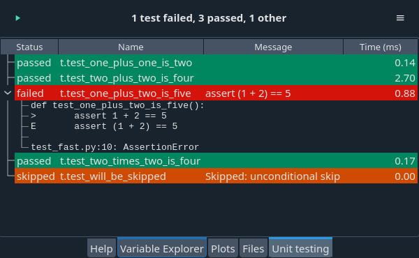

# Spyder-Unittest

## Project information

## Build status

*Copyright © 2014 Spyder Project Contributors*

## Description

Spyder-unittest is a plugin that integrates popular unit test frameworks
with Spyder, allowing you to run test suites and view the results in the IDE.

The plugin supports the `unittest` module in the Python standard library
as well as the `pytest` and `nose` testing frameworks.
Support for `pytest` is most complete at the moment.

## Installation

The unittest plugin is available in the `spyder-ide` channel in Anaconda and in PyPI,
so it can be installed with the following commands:

* Using Anaconda: `conda install -c spyder-ide spyder-unittest`
* Using pip: `pip install spyder-unittest`

All dependencies will be automatically installed.
You have to restart Spyder before you can use the plugin.

## Usage

The plugin adds an item `Run unit tests` to the `Run` menu in Spyder.
Click on this to run the unit tests. After you specify the testing framework
and the directory under which the tests are stored, the tests are run.
The `Unit testing` window pane (displayed at the top of this file) will pop up
with the results. If you are using `pytest`, you can double-click on a test
to view it in the editor.

If you want to run tests in a different directory or switch testing
frameworks, click `Configure` in the Options menu (cogwheel icon),
which is located in the upper right corner of the `Unit testing` pane.

## Feedback

Bug reports, feature requests and other ideas are more than welcome on the
[issue tracker](https://github.com/spyder-ide/spyder-unittest/issues).
Use the [Spyder Google Group](https://groups.google.com/group/spyderlib)
or our [Gitter Chatroom](https://gitter.im/spyder-ide/public)
for general discussion.

## Development

Development of the plugin is done at https://github.com/spyder-ide/spyder-unittest .
You can install the development version of the plugin by cloning the git repository
and running `pip install .`, possibly with the `--editable` flag.

The plugin has the following dependencies:

* [spyder](https://github.com/spyder-ide/spyder) (obviously), at least version 4.0
* [lxml](http://lxml.de/)
* the testing framework that you will be using: [pytest](https://pytest.org)
  and/or [nose](https://nose.readthedocs.io)

In order to run the tests distributed with this plugin, you need
[nose](https://nose.readthedocs.io), [pytest](https://pytest.org)
and [pytest-qt](https://github.com/pytest-dev/pytest-qt). If you use Python 2,
you also need [mock](https://github.com/testing-cabal/mock).

You are very welcome to submit code contributions in the form of pull
requests to the
[issue tracker](https://github.com/spyder-ide/spyder-unittest/issues).
GitHub is configured to run pull requests automatically against the test suite
and against several automatic style checkers using
[ciocheck](https://github.com/ContinuumIO/ciocheck).
The style checkers can be rather finicky so you may want to install ciocheck
locally and run them before submitting the code.

## Contributing

Everyone is welcome to contribute! The document [Contributing to Spyder](
https://github.com/spyder-ide/spyder/blob/master/CONTRIBUTING.md)
also applies to the unittest plugin.

We are grateful to the entire Spyder community for their support, without which
this plugin and the whole of Spyder would be a lot less awesome.

## More information

[Main Website](https://www.spyder-ide.org/)

[Download Spyder (with Anaconda)](https://www.anaconda.com/download/)

[Spyder Github](https://github.com/spyder-ide/spyder)

[Troubleshooting Guide and FAQ](
https://github.com/spyder-ide/spyder/wiki/Troubleshooting-Guide-and-FAQ)

[Development Wiki](https://github.com/spyder-ide/spyder/wiki/Dev:-Index)

[Gitter Chatroom](https://gitter.im/spyder-ide/public)

[Google Group](https://groups.google.com/group/spyderlib)

[@Spyder_IDE on Twitter](https://twitter.com/spyder_ide)

[@SpyderIDE on Facebook](https://www.facebook.com/SpyderIDE/)

[Support Spyder on OpenCollective](https://opencollective.com/spyder/)
